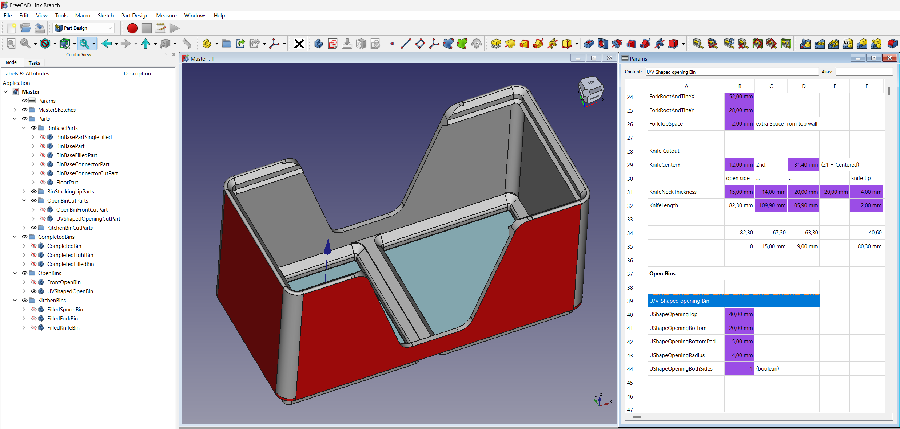
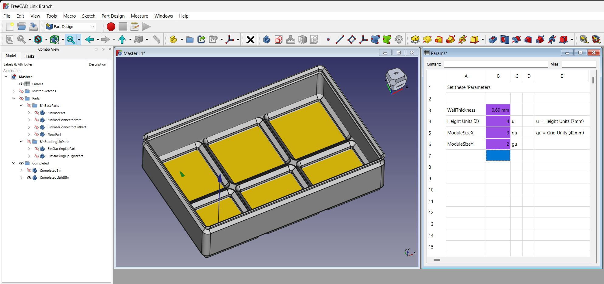
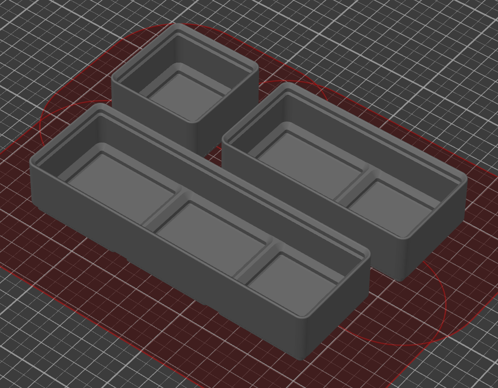
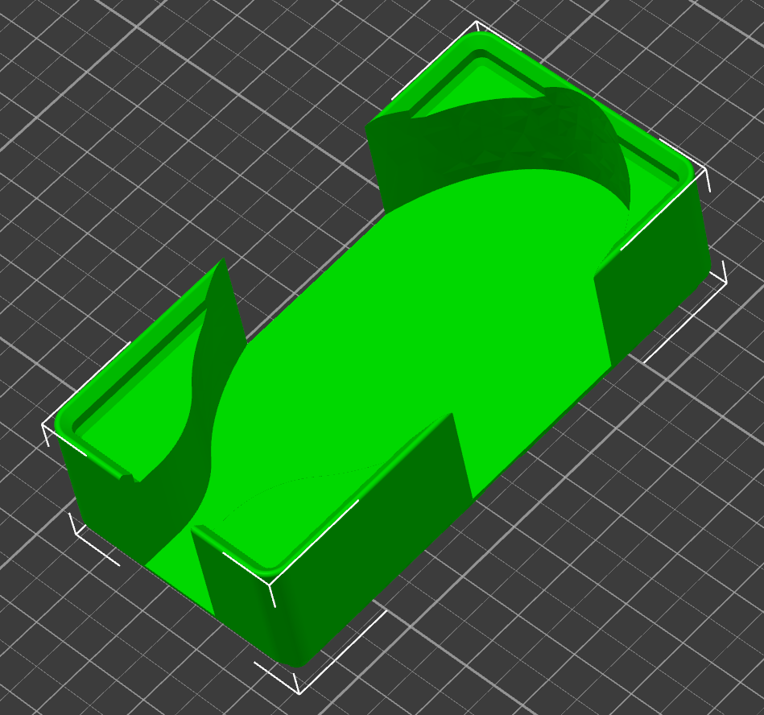

# Gridfinity parts in FreeCAD

Gridfinity is 'The modular, open-source grid storage system for your workshop' by Zack Freedman.

## Please follow Zack Freedman:

* https://www.youtube.com/watch?v=ra_9zU-mnl8
* https://thangs.com/designer/ZackFreedman
* https://instagr.am/zackfreedman
* https://twitter.com/zackfreedman

## What is this?

While learning FreeCAD I started to model basic features of Gridfinity Containers for my kitchen drawer. As there is some visible progress now, I want to show it to you and request your feedback.

## Progress

So far we have basic bins (light, normal and filled variant), boxes opening on one or two side, boxes for spoons, forks, and a box for knifes. Most things are parametric (well: if not defined in the Gridfinity standard I hope we follow 100%) and extendible. To make re-use easier, I'm asking for directions in the FreeCAD Forum here: https://forum.freecad.org/viewtopic.php?t=85557 (plz. help if you know how).

## Help

Pull requests are welcome, as I want to learn more of FreeCAD please be nice and explain your changes to me. Another Option to help would be Coffee, which I would turn into more work:

## FreeCAD Version

I use the RealThunder/Link version, mainly for multiple solids in one body.

* https://github.com/LaggAt/gridfinity-freecad/tree/realthunder
* FreeCAD RealThunder release: https://github.com/realthunder/FreeCAD/releases/tag/20240123stable

## License

Gridfinity is using MIT License, so is this repository. See https://twitter.com/zackfreedman/status/1650629770156326912
